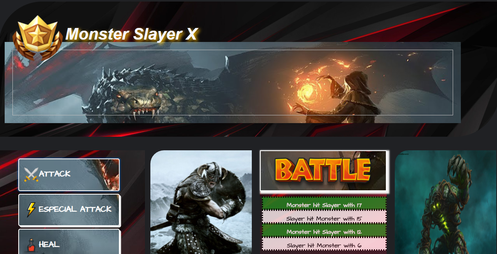

# Experiment Lab 🧪

## Objective

<i> * Creation a table game! </i>

## Features

<i> * Vuejs -> Progressive Framework para construir interfaces a usuários</i>

<i> * Bootstrap -> Responsiveness of the elements</i>

<i> * CSS -> Stylization of elements </i>

<i> * HTML -> Hypertext Markup Language </i>

## Get started

<i> * Open: <b>index.html (located in the src folder)</b></i>

## Application

